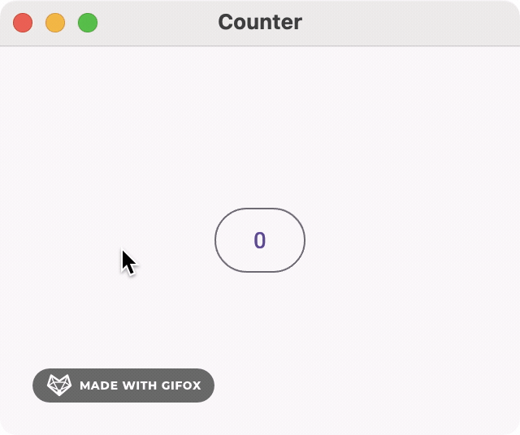
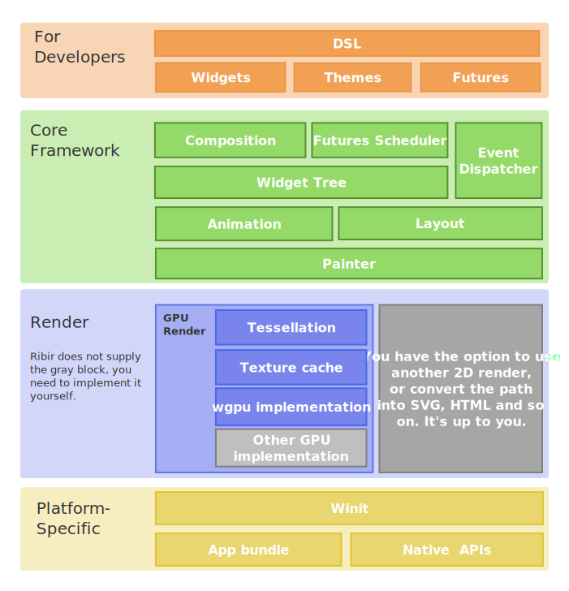

<h1 align="center">
Ribir - Non-intrusive GUI Framework for Rust
</h1>
<p align="center"><a href="https://ribir.org" target="_blank" rel="noopener noreferrer">

</a></p>

<p align="center">
Use Rust to build multi-platform applications from a single codebase.
</p>
<div align="center">

[](https://github.com/RibirX/Ribir/actions/workflows/ci.yml)
[](https://codecov.io/gh/RibirX/ribir)
[](https://crates.io/crates/ribir)
[](https://crates.io/crates/ribir)
[](https://discord.gg/7p3pSrUvmq)
[](https://twitter.com/intent/user?screen_name=ribir_x)


[Website] | [Documents] | [中文文档] | [Web Demo]| [Examples] | [Changelog] | [Releases] | [Roadmap]
</div>


## What's Ribir?

Ribir is a Rust GUI framework that helps you build beautiful and native multi-platform applications from a single codebase.

Experience a novel approach to UI development that's directly based on your data structure APIs. Any data mutation will trigger a precise UI update. Your focus should be on designing your data structure and its APIs. Then, you can describe your data's UI without intruding on its logic.

## At First Glance

A simple example of a counter:


<table>
  <tr>
    <td style="padding:10px">
      <div>

``` rust no_run
use ribir::prelude::*;
fn main() {
  let counter = fn_widget! {
    let cnt = Stateful::new(0);
    @Row {
      @FilledButton {
        on_tap: move |_| *$cnt.write() += 1,
        @{ Label::new("Inc") }
      }
      @H1 { text: pipe!($cnt.to_string()) }
    }
  };
  App::run(counter);
}
```
</div>
    </td>
      <td style="padding:10px">
        
      </td>
    </tr>
</table>

**To use Ribir without DSL**:

```rust no_run
use ribir::prelude::*;

fn main() {
  let counter = |ctx: &BuildCtx| {
    let cnt = Stateful::new(0);

    let c_cnt = cnt.clone_writer();
    let inc_btn = FilledButton::declarer()
      .on_tap(move |_| *c_cnt.write() += 1)
      .finish(ctx)
      .with_child(Label::new("Inc"), ctx);

    let counter = H1::declarer()
      .text(pipe!($cnt.to_string()))
      .finish(ctx);

    Row::declarer()
      .finish(ctx)
      .with_child(inc_btn, ctx)
      .with_child(counter, ctx)
      .build(ctx)
  };

  App::run(counter);
}
```

More [Examples]

## Features

- **Declarative language** It doesn't introduce a completely new language. Instead, it provides a set of Rust macros for easier interaction. You can choose to use it or not.
- **Widgets compose system** has four kinds of widgets to support you can implement your widget in different ways:
  - function widget and `Compose`, from other widgets composition.
  - `Render`, implement your layout and paint anything you want.
  - `ComposeChild`, control the compose logic between parent and child widgets and specify the template of child widgets.  
- **Non-intrusive state** converts your data to a listenable state and updates the view according to the change of the state.
- **Layout system** learning and inspired by [Flutter] Sublinear layout, but not the same.
- **Event system** is a composition event system, that supports event bubbling and capture. Allow to compose with any widget, and exists only if you use it.
- **Theme system** supports full and inherit/partial themes, so you can use it to override or dynamically switch the theme of the subtree. Include palette, icons, animate transitions, the decoration widget of the widget, etc. In a very rough state and the API will be redesigned soon.
- **Animations** based on the state but no side effect, it's almost stable in concept, but not many predefined animations yet.
- **Painter** converts the view to 2D paths.
- **GPU render** is a backend of the **Painter**, do path tessellation so that you can easily render the triangles in any GPU render engine. A [wgpu] implementation is provided as the default GPU render engine. Tessellation base on [lyon].
- **Text** support basic text typography and IME input, in a usable but rough stage.
- **Widgets** library provides 20+ basic widgets, but all are in a rough stage, and the API is not stable yet.

## Architecture overview



## Support Platform 

|Platform|Support situation|
|---|---|
|Linux|✅|
|Windows|✅|
|macOS|✅|
|iOS|🚧 Not yet|
|Android|🚧 Not yet|
|Web|✅|

Ribir is actively being developed and tested on desktop platforms, with both desktop and web platforms integrated into our CI/CD pipeline.

While the framework can compile and run on mobile platforms, we haven't fully tested or adapted the user interface for them yet. We plan to focus on mobile support once the core framework is stable and a production-ready widget library is released.
 
## Love Ribir?

If you like Ribir, give our repo a [⭐ STAR ⬆️](https://github.com/RibirX/Ribir) and [WATCH 👀](https://github.com/RibirX/Ribir/subscription) our repository to stay updated with the latest developments!

Every encouragement and feedback can support us to go further.

## Contributing

We are grateful to the community for contributing bug fixes and improvements.

**😎 New to Ribir?**

Start learning about the framework by helping us improve our [documentation](https://ribir.org/docs/introduction). Feel free to open a [new "Documentation" issue](https://github.com/RibirX/Ribir/issues/new/choose). We are also very welcome:
* Point out to us where our document has misunderstandings
* Pull requests which improve test coverage
* Add undocumented code (e.g. built-in widget)
* Report typo 

For more information please read：
* [Contributing Guide](./CONTRIBUTING.md)
* [Writing a Good Issue](https://developers.google.com/blockly/guides/contribute/get-started/write_a_good_issue)

**🤔 Confused about something?**

Feel free to go to Discussions and open a [new "Q&A"](https://github.com/RibirX/Ribir/discussions/new/choose) to get help from contributors. Often questions lead to improvements to the ergonomics of the framework, better documentation, and even new features!

**😱 Found a bug?**

Please [report all bugs](https://github.com/RibirX/Ribir/issues/new/choose)! We are happy to help support developers fix the bugs they find if they are interested and have the time.


## Thanks

This project exists thanks to all the people who contributed:

<a href="https://github.com/RibirX/Ribir/graphs/contributors">
  
</a>

<br/>

We also found inspiration from the following frameworks:

* [Flutter]
* [QML]

## License
Ribir is [MIT-licensed](./LICENSE)

[Website]: https://ribir.org
[Changelog]: ./CHANGELOG.md
[Releases]: ./RELEASE.md
[Roadmap]: ./ROADMAP.md
[Flutter]: https://flutter.dev/
[QML]: https://doc.qt.io/qt-6/qtqml-index.html
[Examples]: ./examples/
[Documents]: https://ribir.org/docs/introduction
[中文文档]: https://ribir.org/zh/docs/introduction
[wgpu]: https://github.com/gfx-rs/wgpu
[Web Demo]: https://ribir.org/wordle_game/
