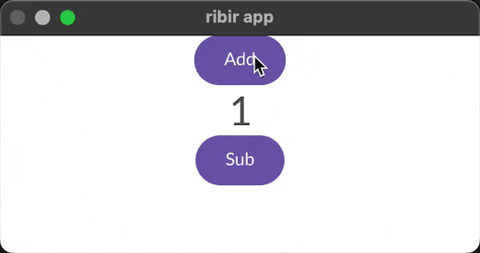

<div align="center">


<!-- # Ribir -->

Ribir is a framework for building modern native/wasm cross-platform user interface applications.


[](https://codecov.io/gh/RibirX/ribir)
[](https://github.com/RibirX/ribir/blob/master/LICENSE)

[Documents] | [Examples]

</div>


## Principles

- **Non-injection and Non-invasive**: Ribir interacts with the APIs of your data structure, and does not require you to do any pre-design for the user interface. Developers can focus on designing the data struct, logic and APIs. Ribir will neither break your existing logic nor require injecting any of its own objects.

- **Declarative**: The user interface is the description of data, the description will automatically react to the data modification. Once you describe your data, the description will keep describing your data.

- **Purely composed**: Ribir creates UI via widgets. There is not a base-object, even if the built-in fields are provided in a composed way. For example,  only if you use `margin` field, the `Margin` widget will be composed, if you do not use it, you don't pay any overhead for `Margin`. "Only pay for what you need" is an important guideline for Ribir.


## At First Glance


<div style="display:inline-block;">
<div style="float:left;height:400px;overflow:scroll; ">

``` rust
use ribir::prelude::*;

fn main() {
  let w = widget! {
    init ctx => {
      let ease_in = transitions::EASE_IN.of(ctx);
      let headline3_style = TypographyTheme::of(ctx).headline3.text.clone();
    }
    states {
      cnt: Stateful::new(0_i32),
    }
    Column {
      Row {
        margin: EdgeInsets::all(2.),
        Button {
          on_tap: move |_| *cnt += 1,
          margin: EdgeInsets::only_right(2.),
          ButtonText::new("Add")
        }
        Button {
          on_tap: move |_| *cnt -= 1,
          margin: EdgeInsets::only_right(2.),
          ButtonText::new("Sub")
        }
      }
      Row {
        Text { text: "current count:" }
        Text {
          id: text,
          text: {
            let cnt = *cnt;
            format!("{cnt}")
          },
          style: headline3_style,
        }
      }
    }
    Animate {
      id: animate,
      transition: ease_in,
      prop: prop!(text.transform),
      from: Transform::translation(0., text.layout_height() * -2.)
    }
    finally {
      let_watch!(*cnt)
        .subscribe(move |_| animate.run());
    }
  };
  app::run(w);
}
```
</div>

</div>

More [Examples]


## Key Features

- **Write once run anywhere**: Compile native code for desktop and mobile(not yet), and WASM for Web(not yet). Since Ribir has rather few platform dependencies, it's not hard to support more platforms by yourself.
- **Declarative language expanded from Rust syntax**: The declarative language is based on Rust, so interaction with Rust becomes natural and easy.
- **Easy custom widget**: Ribir supports the implementation of custom `Compose`, `Render` and `ComposeChild` widgets, you only need to implement the corresponding traits. Evenmore, you are able to specify the template of the children of `ComposeChild`, just by deriving the `Template` traits.
- **Powerful custom theme**: Specify the theme for the whole application or partial subtree. In the theme, you can configure the palette, icons, animate transitions, widget custom themes, the interactive behavior of widget and even compose more decoration widgets on it.
- **Rich available official widgets**: A `ribir_widgets` library exists，containing common desktop and mobile widgets.
- **No side effect animations**: Animation in Ribir is only a visual effect, that won't affect data. Animate support for any render widgets.
- **Alternative rendering backends**: The rendering backend is replaceable, you can implement your own rendering to output image, html, svg or any other stuff. Ribir provides developers with a gpu backend basing on [wgpu] and perhaps a soft(cpu) render in the future.

## Support Platform 

|Platform|Support situation|
|---|---|
|Linux|✅|
|Windows|✅|
|macOS|✅|
|iOS|🚧 Not yet|
|Android|🚧 Not yet|
|Web|🚧 Not yet|

## Contributing

We are grateful to the community for contributing bug fixes and improvements.

**😎 New to Ribir?**

Start learning about the framework by helping us improve our [documentation](https://ribir.org/docs/introduction). Feel free to open a [new "Documentation" issue](https://github.com/RibirX/Ribir/issues/new/choose). We are also very welcome:
* Point out to us where our document has misunderstandings
* Pull requests which improve test coverage
* Add undocumented code (e.g. built-in widget)
* Report typo 

For more information please read：
* [Contributing Guide](./CONTRIBUTING.md)
* [Writing a Good Issue](https://developers.google.com/blockly/guides/contribute/get-started/write_a_good_issue)

**🤔 Confused about something?**

Feel free to go to Discussions and open a [new "Q&A"](https://github.com/RibirX/Ribir/discussions/new/choose) to get help from contributors. Often questions lead to improvements to the ergonomics of the framework, better documentation, and even new features!

**😱 Found a bug?**

Please [report all bugs](https://github.com/RibirX/Ribir/issues/new/choose)! We are happy to help support developers fix the bugs they find if they are interested and have the time.


## Thanks

This project exists thanks to all the people who contribute:

<a href="https://github.com/RibirX/Ribir/graphs/contributors">
  
</a>

<br/>
<br/>

We also found inspiration from the following frameworks:

* [Flutter]
* [QML]

## License

Ribir is [MIT licensed](./LICENSE)

[Flutter]: https://flutter.dev/
[QML]: https://doc.qt.io/qt-6/qtqml-index.html
[Examples]: ./ribir/examples/
[Documents]: https://ribir.org/docs/introduction
[Wgpu]: https://github.com/gfx-rs/wgpu

