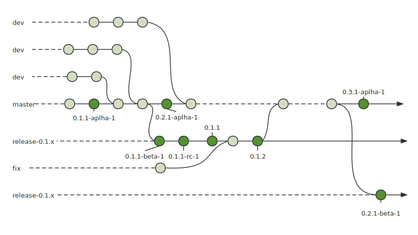

# RELEASES

This document outlines the release process and branch management for the Ribir project. Prior to version 1.0, we don't strictly adhere to [Semantic Versioning](https://semver.org/). Each minor version is treated as a major version and may contain breaking changes. 

## Release Schedule

| Version | Target    | Release Date | Status | Details | Owner   |
|---------|-----------|--------------|--------|---------|---------|
| 0.1     | Prototype, Validate our ideas | Feb 2024     | Beta   | [M1](https://github.com/RibirX/Ribir/milestone/1) | @M-Adoo |
| 0.2     | Improve Core API | March 2024 | Alpha | [M2](https://github.com/RibirX/Ribir/milestone/2) | @M-Adoo |
| 0.3     | Web Compatibility and Widget System API Stabilization | April-May 2024 | Planning | [M3](https://github.com/RibirX/Ribir/milestone/3) | @wjian23 |
| 0.4     | Theme API Stabilization and State Provider | May-June 2024 | Planning | TBA | @sologeek |
| Future  | To be determined | To be determined | Planning | To be determined | To be determined |

### Branch Management

Our goal is to keep the `master` branch in a working state at all times, ready for an alpha release whenever necessary. The `master` branch is used for active development and preparation for the next release. An alpha version is automatically released every week, allowing us to use the upcoming version during its development cycle.

Each minor release has its own distinct branch, named `release-<major>.<minor>.x`, such as `release-0.1.x`, `release-0.2.x`. Please avoid using names that start with `release-` for your development branches. To keep things manageable, we only maintain the most recent release branch.

If you wish to contribute to the current release, please submit a pull request to merge it into the `release-<major>.<minor>.x` branch. If you wish to contribute to the next release, please submit a pull request to merge it into the `master` branch.

Once the development of the next release is complete, we will release the `beta` version and create a new `release-<major>.<minor>.x` branch from the `master` branch. The `master` branch will then be used for the next release and will transition to the `<major>.<minor+1>.1-alpha-0` version.

In the release branch, we only accept bug fixes and documentation changes. All other changes should be merged into the `master` branch and will be included in the next release.

The diagram below provides a clear and simple overview of our branch management and version release process:

### Tools

All version releases and branch management are handled by GitHub Actions. Administrators should not manually perform these tasks through the command line.

Here are the GitHub Actions you should be aware of:

- **Alpha release**: Every week, an alpha version is automatically released in the `master` branch. Manual triggering is also supported if needed.
- **New Development Cycle**: Starts a new development cycle when the next release is ready. Only supports manual triggering. This action will:
  1. Release a beta version
  2. Create a new release branch from the `master` branch
  3. Update the version in the `master` branch to the next minor alpha version
- **Patch version**: Releases a beta, rc, or patch version in the release branch. Only supports manual triggering.

### Changelog Management

We use [keep a changelog](https://keepachangelog.com/en/1.0.0/) to manage the changelog. The changelog should be updated in every pull request and kept human-readable.

When a version is released, certain replacements will occur in the changelog, such as replacing `@Unreleased` with the version number. The changelog of the release version will be extracted to create a GitHub release note.

When a version transitions from alpha to beta, all alpha versions' changelogs will be merged into the new beta version. When a version transitions from pre-version to stable, all the changelogs of the pre-versions will be merged into the new stable version. These tasks are all handled by GitHub Actions.