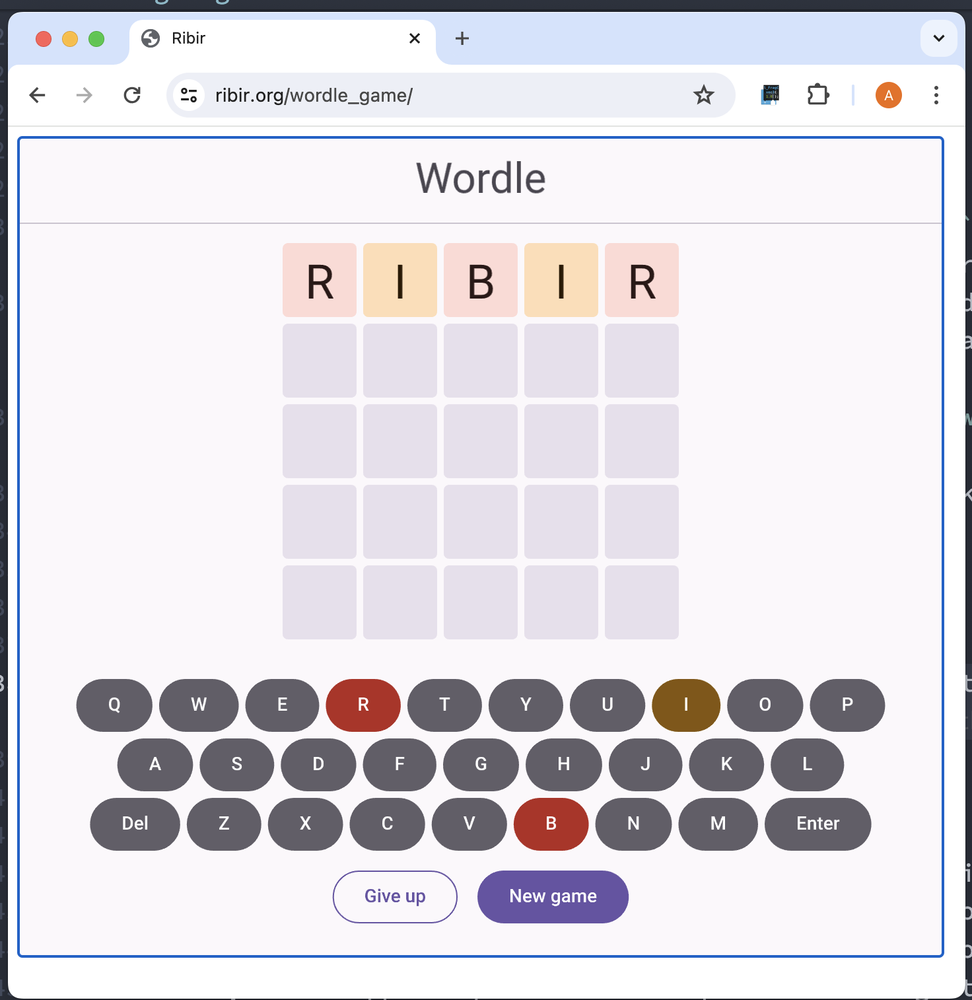

# Changelog 0.3.x

This file contains the changelog entries for Ribir 0.3.x releases.

For the latest changes, see [CHANGELOG.md](../CHANGELOG.md).

## [0.3.0](https://github.com/RibirX/Ribir/releases/tag/ribir-v0.3.0) - 2024-08-26

We're thrilled to announce that Ribir now supports the Web platform! 🎉🎉🎉

Experience the power of compiling Rust code to wasm and rendering it with WebGPU or WebGL.

Check out our Wordle game demo, now running smoothly in your browser!

[](https://ribir.org/wordle_game/)

### Features

- **ci**: Added wasm test (\#583 @wjian23)
- **ci**: wasm server watch file change (\#586 @wjian23)
- **core**: Introduced `StateWatcher` for watching state modifies, which was previously the responsibility of `StateReader`. This results in a cleaner and more compact `StateReader` implementation. (\#556, @M-Adoo)
- **core**: The split functions in `StateReader::part_reader`, `StateWriter::map_writer`, and `StateWriter::split_writer` no longer need to return a reference. (\#568 @M-Adoo)
- **gpu**: Introduced `GPUBackendImpl::max_textures_per_draw` to set a limit on textures per draw phase (\#562 @M-Adoo)
- **gpu**: Updated the `wgpu` implementation of the GPU backend to support WebGL. (\#578, @M-Adoo)
- **macros**: Added a `include_crate_svg!` macro to include the svg relative to current crate. (\#552, @M-Adoo)
- **painter**: Introduced support for bundled commands, enabling the backend to process these commands as a single entity and cache the resulting output. (\#589 @M-Adoo)
- **painter**: Introduced support for `Resource<Path>` for drawing. This indicates that the `Path` may be shared with others, allowing the backend to cache it. (\#589 @M-Adoo)
- **ribir**: Added a `nightly` feature to enable functionalities that require nightly Rust. (\#552, @M-Adoo)
  - The `include_crates_svg!` macro can operate without the `nightly` feature.
  - The `include_svg!` macro requires the `nightly` feature to be enabled.
- **ribir**: Introduced `AppRunGuard` to allow app and window configuration prior to app startup. (\#565, @M-Adoo)
  Previously, to configure the app and window before startup, `App::run` couldn't be used:
  ```rust
  unsafe {
    AppCtx::set_app_theme(material::purple::light());
  }
  
  App::new_window(root, None).set_title("Counter");
  App::exec();
  ```
  Now, with AppRunGuard, you can use `App::run` and chain the configuration methods:
  ```rust
  App::run(root)
    .with_app_theme(material::purple::light())
    .with_title("Counter");
  ```
- **ribir**: support stable Rust 1.77.0 (\#552 @M-Adoo)

### Fixed

- **examples**: fix crash issue in Storybook (\#559 @M-Adoo)
- **gpu**: Retrieve the texture limit size from the GPU instead of using a hardcoded value. (\#578, @M-Adoo)
- **ribir**: fixed the crash issue when the shell window is zero-sized at startup. (\#582, @M-Adoo)
- **ribir**: Resolved the issue causing a black screen on the first frame. (\#566, @M-Adoo)

### Changed

- **algo**: removed `Resource` and rename `ShareResource` to `Resource`. (\#564, @M-Adoo)
- **core**: Enhanced panic location tracking during widget build (\#559 @M-Adoo)
- **core**: rename builtin field of `delay_drop_until` to `keep_alive` (\#561 @wjian23)
- **dev-helper**: If test images differ, both actual and difference images are saved with the expected image. (\#573 @M-Adoo)
- **dev-helper**: Support specific the comparison of image tests. (\#573 @M-Adoo)
- **example**: run example in web wasm (\#571 @wjian23)
- **gpu**: Removed dependency on the texture array feature of wgpu. (\#562, @M-Adoo)
- **gpu**: The GPU backend no longer relies on MSAA, which is dependent on the graphics API. Instead, it uses the alpha atlas to provide a solution similar to SSAA.(\#584, @M-Adoo)
- **gpu**: The GPU backend now only caches the path command if it is a `Resource`. This change reduces GPU memory usage and accelerates cache detection. (\#589 @M-Adoo)
- **macros**: polish the compile error message of invalid field in `@(var) {}` (\#556 @M-Adoo)
- **painter**: Removed the AntiAliasing feature from the `painter` package, This responsibility now lies with the painter backend. (\#584 @M-Adoo)
- **text**: Implemented caching of the glyph path as a `Resource` to improve performance. (\#589 @M-Adoo)

### Documented

- **core**: Explained when to use `unsubscribe` with `watch!`. (\#556, @M-Adoo)

### Breaking

- **core**: The `StateReader` no longer supports watching its modifications. Use the `StateWatcher` trait instead for this functionality. (\#556 @M-Adoo)
- **macros**: removed `map_writer!` and `split_writer!` macros. (\#568, @M-Adoo)
- **painter**: Changes to `BackendPainter` APIs. This only affects you if you've implemented a custom painter. (\#562 @M-Adoo)
- **ribir**: compile wasm (\#543 @wjian23)
- **ribir**: `StateWriter::map_writer` and `StateWriter::split_writer` now only require a writer split function, enhancing both reader and writer split operations. (\#568, @M-Adoo)
- **ribir**: The window creation APIs have been updated to use asynchronous methods, improving compatibility with browsers. (\#565, @M-Adoo)
- **ribir**: Updated `App::new_window` to accept `WindowAttributes` instead of size as the second parameter. (\#565, \#566, @M-Adoo)


