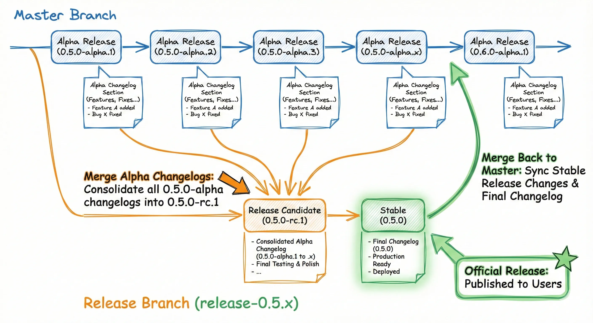

# Release Strategy

**Topic:** Release flow, versioning strategy, and decision-making
**Status:** Handbook

---

## Release Flow Overview

```
┌─────────────────────────────────────────────────────────┐
│ Alpha Releases (master branch: 0.5.0-alpha.x)           │
│                                                         │
│ Generated materials:                                    │
│  • Changelog entries (from merged PRs)                  │
│  • CHANGELOG.md (alpha version section)                 │
│  • GitHub Release (basic notes only)                    │
│  ✗ No social cards, no highlights                       │
│                                                         │
│ Frequency: Weekly automatic + manual trigger            │
└─────────────────────────────────────────────────────────┘
                    ↓ Features complete, ready for release
┌─────────────────────────────────────────────────────────┐
│ Release Candidate (release-0.5.x branch: 0.5.0-rc.1)    │
│                                                         │
│ Generated materials:                                    │
│  • Collect & merge changelog from all alpha versions    │
│  • Highlights in PR body (editable, ribir-bot AI)       │
│  • Social card preview (prepared for stable) - future   │
│                                                         │
│ Activities:                                             │
│  • Create PR: release-0.5.x → master (kept open)        │
│  • Community reviews and discusses materials in PR      │
│  • Preview social card in PR (not in RC assets)         │
│  • Edit highlights in PR body as needed                 │
│  • Material regeneration if important PRs merged        │
│  • User testing: 1 week                                 │
│  • Merge PR when stable is ready to publish             │
└─────────────────────────────────────────────────────────┘
                    ↓ RC testing passed, materials finalized
┌─────────────────────────────────────────────────────────┐
│ Stable Release (release-0.5.x branch: 0.5.0)            │
│                                                         │
│ Generated materials:                                    │
│  • Merge bug fix entries from RC versions (if multiple) │
│  • Extract highlights from PR body → CHANGELOG.md       │
│  • Update CHANGELOG.md with final version section       │
│                                                         │
│ Published materials:                                    │
│  • GitHub Release (tag v0.5.0)                          │
│    - Release notes from CHANGELOG.md with highlights    │
│    - Social card as release asset (when ready)          │
│                                                         │
│ Note: Highlights prepared in PR body, written to        │
│       CHANGELOG.md at stable release                    │
└─────────────────────────────────────────────────────────┘
                    ↓ Ongoing maintenance
┌─────────────────────────────────────────────────────────┐
│ Patch Releases (release-0.5.x branch: 0.5.1, 0.5.2...)  │
│                                                         │
│ Generated materials:                                    │
│  • Changelog entries (bug fixes only)                   │
│  • CHANGELOG.md (patch version section)                 │
│  • GitHub Release (basic notes only)                    │
│  ✗ No highlights, no social cards                       │
│                                                         │
│ Process: Collect changelog → publish immediately        │
└─────────────────────────────────────────────────────────┘
```

### Design Rationale

**Why Alpha → RC → Stable?**
- Eliminates ambiguous beta phase
- Single pre-release testing window (RC)
- Simpler decision making: "ready for users?" → RC
- Reduces changelog merge complexity

**Why weekly alphas?**
- Fast feedback loop for contributors
- Users can test latest features immediately
- Low overhead (automated, no social cards)

**Why social cards for RC/Stable only?**
- RC phase: Prepare materials with community review
- Stable phase: Publish finalized materials
- Alphas are for iteration, not promotion

### Branch Merge Flow

The branch merging process consolidates changes from multiple pre-release versions:



**Key merging points:**
- **RC creation**: Merge all alpha versions (0.5.0-alpha.1 through alpha.x) into RC
- **Stable creation**: Merge all RC versions (if multiple) into stable
- **Backporting**: Release branch changes can merge back to master without conflicts


---

## Release Types

### 1. Alpha Releases (0.5.0-alpha.x)

**Purpose:** Fast iteration and early feedback

**Characteristics:**
- Branch: `master`
- Frequency: Weekly automatic + manual trigger
- Stability: Experimental, may have bugs
- Materials: Basic changelog only, no promotional materials

**When to use:**
- Regular weekly cadence
- After merging significant PRs (manual trigger)
- When you want early user feedback

**Version increment:** `0.5.0-alpha.23 → 0.5.0-alpha.24`

**Verification Checklist:**
- [ ] GitHub Release appears on releases page
- [ ] Version number incremented correctly
- [ ] CHANGELOG.md updated with new section
- [ ] Release marked as "Pre-release"
- [ ] Package published to crates.io

---

### 2. Release Candidate (0.5.0-rc.1)

**Purpose:** Final testing + prepare release materials for stable

**Characteristics:**
- Branch: `release-0.5.x` (newly created)
- Frequency: Once per minor version (typically)
- Stability: Feature-complete, bug fixes only
- Duration: 1 week of user testing
- Materials: Collect & merge changelog from all alpha versions, generate highlights in CHANGELOG, social card preview in PR (not included in RC assets)

**What happens in RC:**
- **Preparation:** Archive CHANGELOG.md on master (→ changelogs/CHANGELOG-0.5.md), then create `release-0.5.x` branch
- **Technical:** Community tests the release candidate
- **Materials:** Collect & merge changelogs, generate highlights in PR body (editable), review and refine via PR (kept open until stable)
- **RC Period PRs:** If important bug fixes are merged, materials can be regenerated
- **PR workflow:** Preview, discuss, adjust highlights directly in PR body
- **Outcome:** Finalized highlights in PR ready for stable release

**When to use:**
- All planned features for 0.5.0 are complete
- Ready to stabilize for release
- Need community testing before going stable

**Version increment:** `0.5.0-rc.1 → 0.5.0-rc.2` (if critical bugs found, usually only need rc.1)

### RC to Stable Flow

#### Phase 1: Preparation (Manual)
**Trigger:** Release manager runs `release enter-rc` workflow.
- Creates release branch `release-0.5.x` from master.
- Archives CHANGELOG.md on master (→ changelogs/CHANGELOG-0.5.md).
- Collects and merges all alpha changelogs.
- AI generates highlights in the PR body (not CHANGELOG.md yet).
- Creates "Stable Preparation" PR (`release-0.5.x` → `master`) for human review.
- **Automatically publishes RC.1** (v0.5.0-rc.1).

#### Phase 2: Review Period (Human)
**During RC testing (1-2 weeks):**
- Community tests the RC.1 release.
- PR remains open for reviewing release materials (highlights in PR body, changelog).
- Use `@ribir-bot release-highlights` to regenerate if needed.
- Edit highlights directly in PR body - changes are easy to make.
- If critical bugs are found and fixed, manually run `Release RC` to publish rc.2, rc.3, etc.

**Review Checklist:**
- [ ] All important PRs included in changelog
- [ ] ⚠️ **AI Safety Check:** Verify highlights in PR body are real and accurate (no AI hallucinations)
- [ ] Highlights section makes sense (3-5 items)
- [ ] (Future) Social card is readable and accurate
- [ ] Version number and date correct

#### Phase 3: Stable Publishing (Bot-Driven)
**Trigger:** Use `@ribir-bot release-stable` command in the preparation PR.
- Bot publishes to crates.io and creates GitHub Release v0.5.0 (stable).
- Bot automatically merges the preparation PR to master.
- **Note:** Do NOT manually merge the PR. The `do-not-merge` label prevents accidental manual merges.

**See:** [01-changelog-automation.md](01-changelog-automation.md#4-release-materials) for highlights and social card details

---

### 3. Stable Release (0.5.0)

**Purpose:** Official release + publish materials

**Characteristics:**
- Branch: `release-0.5.x` (same as RC)
- Frequency: After RC testing passes
- Stability: Production-ready
- Materials: CHANGELOG with highlights, social card (when ready)

**What happens in Stable:**
1. Use `@ribir-bot release-stable` command in the preparation PR
2. Bot merges bug fix changelog from RC versions (if rc.2, rc.3 exist)
3. Bot extracts highlights from PR body and writes to CHANGELOG.md
4. Bot publishes to crates.io and creates GitHub Release
5. Bot removes `do-not-merge` label and merges PR to master

**When to use:**
- RC testing completed successfully (1～2 weeks, or 1 week with no feedback)
- Materials reviewed and finalized
- Finalized release ready for publication

**Version:** `0.5.0-rc.1 → 0.5.0` (remove pre-release tag)

**Verification Checklist:**
- [ ] GitHub Release v0.5.0 published (stable, not pre-release)
- [ ] Social card attached (when implemented)
- [ ] CHANGELOG.md contains highlights section (extracted from PR body)
- [ ] Pre-release flag removed
- [ ] Package published to crates.io

---

### 4. Patch Releases (0.5.1, 0.5.2, ...)

**Purpose:** Bug fixes only

**Characteristics:**
- Branch: `release-0.5.x`
- Frequency: As needed (when bugs found)
- Changes: Bug fixes only (no features)
- Materials: Basic changelog only, no promotional materials

**When to use:**
- Critical bugs in stable release
- Security fixes
- Important bug fixes for production users

**Version increment:** `0.5.0 → 0.5.1 → 0.5.2 ...`

**Process:**
- Collect changelog entries from bug fix PRs
- Publish immediately (no highlights, no social cards)

**Verification Checklist:**
- [ ] GitHub Release appears
- [ ] Changelog updated on release branch
- [ ] Version number correct
- [ ] Package published to crates.io

---

## Design Principles

### 1. YAGNI (You Aren't Gonna Need It)

**Removed:**
- ❌ Beta phase - unclear value, adds complexity
- ❌ Multiple beta versions (beta.1, beta.2) - use RC instead
- ❌ Complex alpha→beta→stable changelog merging

**Kept:**
- ✅ Weekly alpha releases - users want them
- ✅ Release branches - needed for LTS
- ✅ RC phase - valuable testing window

### 2. Fast Feedback Loop

- Alpha releases every week (or on-demand)
- Users can test latest features immediately
- Maintainers get quick feedback on changes

### 3. Single Responsibility

Each release type has one clear purpose:
- **Alpha**: Rapid iteration, early feedback
- **RC**: Stabilization testing + material preparation (highlights in CHANGELOG)
- **Stable**: Official release + material publication (social card)
- **Patch**: Bug fixes only

### 4. Clear Communication

Version numbers clearly indicate stability:
- `0.5.0-alpha.24` - Experimental
- `0.5.0-rc.1` - Testing needed
- `0.5.0` - Production ready
- `0.5.1` - Bug fixes

---

## Decision Matrix: When to Release

### Should I cut an alpha?

| Scenario | Release Alpha? | Why |
|----------|---------------|-----|
| Weekly Tuesday (auto) | ✅ Yes | Regular cadence |
| Major PR merged | ✅ Yes (manual) | Let users test ASAP |
| Small bug fix | ⚠️ Maybe | Wait for batch or weekly |
| Breaking change | ✅ Yes (manual) | Important to test early |
| Documentation only | ❌ No | Not user-facing |

### Should I cut an RC?

| Scenario | Release RC? | Why |
|----------|------------|-----|
| All features complete | ✅ Yes | Ready to stabilize |
| Some features incomplete | ❌ No | Wait for completion |
| Major bugs in alpha | ❌ No | Fix first, then RC |
| Users requesting stable | ✅ Yes | Good signal |
| Major milestone (0.5.0) | ✅ Yes | Important version |

### Should I go stable?

| Scenario | Go Stable? | Why |
|----------|-----------|-----|
| RC tested for 1 week, no issues | ✅ Yes | Ready |
| Critical bug in RC | ❌ No | Fix and cut RC.2 |
| Minor bug in RC | ⚠️ Maybe | Assess severity |
| Users report success | ✅ Yes | Community validation |
| No community testing after 1 week | ✅ Yes | Early stage, limited users |

---

## FAQ

**Q: Why remove the beta phase?**
A: Beta's purpose overlapped with RC. Having both created confusion about when to use each. RC is sufficient as a single pre-release testing phase.

**Q: What if RC has bugs?**
A: Fix in release branch and cut rc.2. Only severe bugs should block stable release.

**Q: Can we have multiple RCs?**
A: Yes, but ideally only 1-2. If you need rc.3+, consider going back to alpha to fix fundamental issues.

**Q: How long should RC testing last?**
A: 1 week is typical. If no community feedback after 1 week, can proceed to stable (early stage, limited users).

**Q: Do we still support old release branches?**
A: Only the most recent minor version. Older versions are community-supported.

**Q: What about breaking changes?**
A: Before 1.0, breaking changes can go in minor versions (0.5.0 → 0.6.0). After 1.0, follow semver strictly.

**Q: What happens to CHANGELOG.md when starting a new minor version?**
A: Before creating the RC branch, `ribir-bot release prepare` archives CHANGELOG.md on master (→ `changelogs/CHANGELOG-0.5.md`) and creates a fresh one for 0.6.x. Then the RC branch is created from this commit. This ensures the release branch can update `changelogs/CHANGELOG-0.5.md` while master updates `CHANGELOG.md`, avoiding merge conflicts. See [01-changelog-automation.md](01-changelog-automation.md#starting-a-new-minor-version) for details.

---

## Related Documentation

- [01-changelog-automation.md](01-changelog-automation.md) - Changelog collection, format, and release materials
- [03-social-card-generation.md](03-social-card-generation.md) - Social card tooling details
