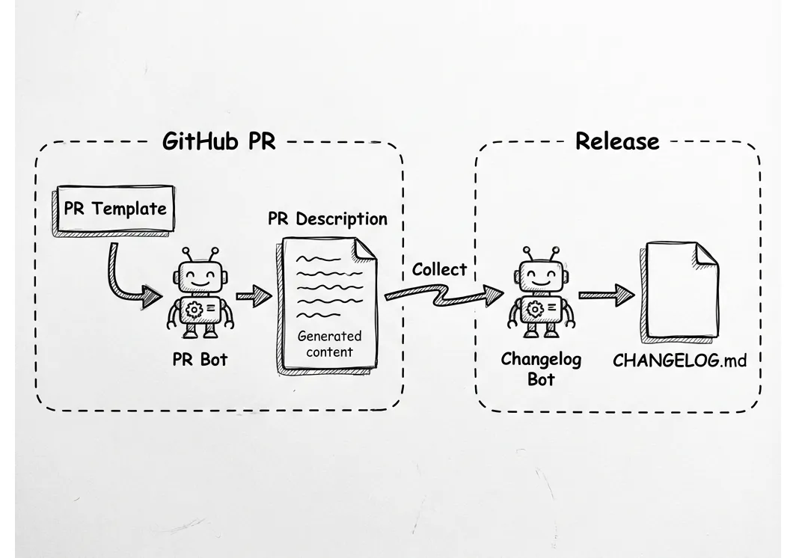
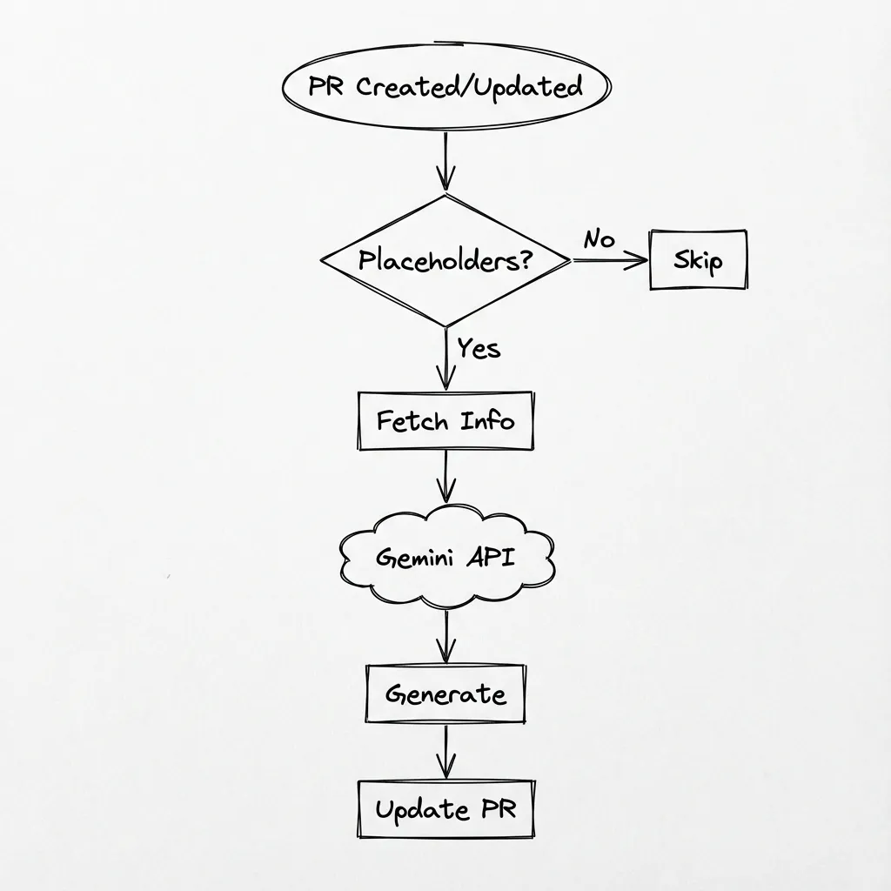

# Changelog Automation

**Topic:** PR bot and changelog collection automation
**Status:** Foundation of the release system

> **Note:** For complete command reference, run `ribir-bot --help` or see [tools/ribir-bot/README.md](../../tools/ribir-bot/README.md)

---

## Overview

The changelog automation system automates the collection and organization of changes throughout the development cycle. It consists of three components working together:



**Components:**
- **PR Template** - Standardized format for changelog entries
- **PR Bot** - AI-powered summary and changelog generation
- **Changelog Bot** - Collects and merges entries into CHANGELOG.md

**Key Outputs:**
- **CHANGELOG.md** - Categorized changelog entries for all releases
- **Highlights Section** - 3-5 key changes for RC/Stable releases (embedded in CHANGELOG.md)
- **Social Cards** - Visual preview images for social media (future)

---

## System Components

### 1. PR Template

The PR template ([pull_request_template.md](../../.github/pull_request_template.md)) provides a standardized structure for all pull requests.

**Key Features:**
- Changelog entry placeholders with special markers
- AI-recognizable format for auto-generation
- Consistent structure for automated collection

**Special Markers:**
```markdown
<!-- RIBIR_CHANGELOG_START -->
...changelog entries...
<!-- RIBIR_CHANGELOG_END -->
```

These markers enable:
- PR Bot to identify where to generate content
- Changelog Bot to extract entries during release

**Changelog Entry Format:**

Follows [Conventional Commits](https://www.conventionalcommits.org/) specification:

```
- type(scope): description
```

**Available Types:**

| Type | Description | Example |
|------|-------------|---------|
| `feat` | New feature | `feat(widgets): Add dark mode support` |
| `fix` | Bug fix | `fix(gpu): Memory leak in event handling` |
| `change` | Modification to existing functionality | `change(core): Simplify API surface` |
| `perf` | Performance improvement | `perf(render): 50% faster WASM rendering` |
| `docs` | Documentation update | `docs(readme): Update installation guide` |
| `breaking` | Breaking change | `breaking(api): Remove deprecated methods` |

**Available Scopes:**

`core` | `gpu` | `macros` | `widgets` | `themes` | `painter` | `cli` | `text` | `tools`

**Skipping Changelog:**

For changes that don't need recording (tests, CI configs, infra, or unreleased fixes), check:
```markdown
- [x] 🔧 No changelog needed (tests, CI, infra, or unreleased fix)
```

---

### 2. PR Automation

**Purpose:** Uses Gemini AI to automatically generate PR summaries and changelog entries.

**Location:** [tools/ribir-bot](../../tools/ribir-bot)

Ribir uses an AI-powered bot to analyze code changes and descriptions, automatically filling in the PR summary and suggested changelog entries. This ensures consistency and reduces the manual burden on contributors.

> **Reference:** For technical CLI usage and comment triggers, see [tools/ribir-bot/README.md](../../tools/ribir-bot/README.md#pr-commands).

#### Workflow



**Typical workflow:**
1. **Create PR** - Use template, PR Bot auto-generates summary and changelog
2. **Review** - Check generated content, adjust if needed
3. **Refine** - Use `@pr-bot` commands to regenerate with context if necessary
4. **Merge** - Changelog entries are stored in PR description for later collection

#### Requirements

- Rust nightly (for `-Zscript`)
- `gh` CLI (authenticated)
- `gemini` CLI
- `GEMINI_API_KEY` environment variable

---

### 3. Changelog Management

**Purpose:** Manages CHANGELOG.md structure and collects entries from merged PRs.

**Location:** [tools/ribir-bot](../../tools/ribir-bot)

The system automatically scans merged pull requests to extract and categorize changelog entries, updating the appropriate changelog files based on the release branch.

> **Reference:** For technical CLI usage and options, see [tools/ribir-bot/README.md](../../tools/ribir-bot/README.md#changelog-commands).

#### Collect Command Flow


**Process:**
1. Scans merged PRs since last release
2. Extracts changelog entries from PR descriptions
3. Categorizes entries by type
4. Updates CHANGELOG.md with new version section

#### Section Mapping

PR types are automatically mapped to CHANGELOG.md sections:

| PR Type | CHANGELOG Section |
|---------|-------------------|
| `feat`, `feature` | 🎨 Features |
| `fix`, `fixed` | 🐛 Fixed |
| `change`, `changed` | 🔄 Changed |
| `perf`, `performance` | ⚡ Performance |
| `docs`, `doc` | 📚 Documentation |
| `breaking`, `break` | 💥 Breaking |
| `internal`, `chore`, `refactor` | 🔧 Internal |

---

## Release-Specific Workflows

### Commands by Release Type

| Release Type | Branch | Command | Target File | Source |
|--------------|--------|---------|-------------|--------|
| Alpha (0.5.0-alpha.x) | `master` | `log-collect` | `CHANGELOG.md` | Merged PRs |
| RC (0.5.0-rc.1) | `release-0.5.x` | `log-merge` | `changelogs/CHANGELOG-0.5.md` | All alphas from `CHANGELOG.md` |
| Stable (0.5.0) | `release-0.5.x` | `log-merge` | `changelogs/CHANGELOG-0.5.md` | All RCs (if multiple) |
| Patch (0.5.1) | `release-0.5.x` | `log-collect` | `changelogs/CHANGELOG-0.5.md` | Merged PRs |

**Key Principles:**
- **master branch** → always writes to `CHANGELOG.md`
- **release-x.y.z branch** → always writes to `changelogs/CHANGELOG-x.y.md`

### Alpha Releases

**Process:**
1. The system identifies merged PRs since the last alpha release.
2. Creates a new version section in `CHANGELOG.md`.
3. Categorizes and adds all merged PR entries automatically.

**Output:** Basic changelog entries only (no highlights, no social cards)

### RC/Stable Releases

**Process:**
1. During RC.1 preparation, the system merges all previous alpha changelog entries.
2. AI analyzes entries and generates a highlights section.
3. A preparation PR is created for human review.
4. After approval, materials are finalized for the RC.1 release.

**For Stable Release:**
- If multiple RC versions exist (rc.2, rc.3), only bug fix changelog entries are merged.
- Highlights and social cards from RC.1 are reused.

**Output:**
- Merged changelog entries (including bug fixes from all RC versions if multiple)
- AI-generated highlights section (3-5 key changes, generated once during RC.1 preparation)
- Social card preview in PR (future, not included in RC assets)

### Patch Releases

**Process:**
1. The system identifies bug fix PRs merged to the release branch.
2. Adds entries to the version-specific changelog (e.g., `changelogs/CHANGELOG-0.5.md`).

**Output:** Basic changelog entries only (no highlights, no social cards)

---

## Release Materials

This section covers the promotional materials generated for RC and Stable releases. Alpha and Patch releases do not generate these materials.

### Highlights Section

#### Purpose

Highlights are embedded directly in CHANGELOG.md as a special section for each RC/Stable release.

**Content:**
- 3-5 most impactful changes from the release
- Concise, user-friendly descriptions
- Visual indicators (emojis) for quick scanning

#### Format

Highlights appear at the top of each RC/Stable release section:

```markdown
## [0.5.0] - 2025-01-15

**Highlights:**
- ⚡ 50% faster WASM rendering
- 🎨 Dark mode support for all widgets
- 🔧 Plugin system for extensibility
- 🐛 Fixed memory leak in event handling

### 🎨 Features
- feat(widgets): Add dark mode support across all components
- feat(core): Implement plugin system for extensibility
...

### 🐛 Fixed
- fix(gpu): Memory leak in event handling
...
```

**Format Guidelines:**
- **Location**: Immediately after release header, before categorical sections
- **Count**: 3-5 items (not more, not less)
- **Style**: Emoji + brief description (under 60 characters)
- **Emojis**: ✨🎨⚡🐛📚💥🔧 (match change type)

#### AI-Powered Generation

During RC preparation, the system uses Gemini AI to analyze all changelog entries and generate the highlights section.

**Selection Criteria:**
1. **Impact** - User-facing changes prioritized over internal refactors
2. **Newsworthy** - Features and performance improvements over minor fixes
3. **Diversity** - Cover different areas (widgets, core, performance, etc.)
4. **Clarity** - Changes that are easy to understand and explain

**Note:** If AI is unavailable, the workflow will fail and require manual addition of the highlights section.

#### Human Review

The AI-generated highlights are reviewed in the RC preparation PR. Edit CHANGELOG.md directly in the PR branch to adjust highlights or fix any issues.

**Tips for Good Highlights:**
- Keep text under 60 characters
- Focus on user benefits, not implementation details
- Use active voice ("Add dark mode" not "Dark mode added")
- Avoid jargon and technical terms
- Select diverse changes (don't pick 5 widget updates)

**Current Status:** Manual - highlights section is currently added manually. Future implementation will use AI to auto-generate this section.

---

### Social Cards

**Status:** Future feature - See [03-social-card-generation.md](03-social-card-generation.md)

Social cards (Open Graph images for social media previews) will be generated using the standalone `ribir-render` tool.

**Planned Workflow:**
```
CHANGELOG.md (with highlights)
    ↓
ribir-render social-card
    ↓
social-card.png (1200x630)
    ↓
Attached to GitHub Release (Stable only)
```

**Until Implemented:** Social cards are created manually or omitted.

---

## File Organization

### CHANGELOG.md Structure

**Master Branch:**
```
CHANGELOG.md                         ← Active development changelog
```

When starting a new minor version (e.g., 0.6.x), the master branch CHANGELOG.md is archived:

```markdown
# Changelog

All notable changes to this project will be documented in this file.

For older versions:
- [0.5.x changelog](changelogs/CHANGELOG-0.5.md)
- [0.4.x changelog](changelogs/CHANGELOG-0.4.md)
- [0.3.x changelog](changelogs/CHANGELOG-0.3.md)

<!-- New version sections will be added here by ribir-bot -->
```

**Key Points:**
- No `[Unreleased]` section - entries are stored in PR descriptions
- New version sections are created directly (e.g., `## [0.6.0-alpha.1]`)
- Archiving is coordinated automatically during RC preparation

**Release Branches:**
```
changelogs/
└── CHANGELOG-0.5.md                 ← Version-specific changelog
```

### Storage Strategy

**In Repository (Committed):**
```
CHANGELOG.md                         ← Contains highlights inline
```

**Why Committed:**
- CHANGELOG.md is the authoritative source of truth
- Highlights are integral to release documentation
- Allows users to see highlights without leaving GitHub/repo

**GitHub Release Assets (Not Committed):**
```
Release v0.5.0
├── social-card.png                  ← Promotional image
└── [binaries and other assets]
```

**Why Not Committed:**
- Social cards do not need to be archived in the repository
- Free CDN-backed hosting by GitHub
- Tied to a specific release
- Available for external tools to consume via release link

---

## Integration with Release System

The changelog automation provides the foundation for the entire release system:

**During Development (Alpha):**
- PR Bot generates changelog entries for each PR
- Changelog Bot collects entries into CHANGELOG.md weekly

**During RC Preparation:**
- Changelog Bot merges all alpha entries
- AI generates highlights section
- Materials are reviewed via PR

**During Stable Release:**
- Finalized CHANGELOG with highlights is published
- Social card is attached to GitHub Release (future)

**For complete release workflow, see [00-release-strategy.md](00-release-strategy.md).**

---

## Troubleshooting

### PR Bot Not Triggered

**Symptoms:** PR created but no auto-generated content

**Solutions:**
- Confirm PR description contains placeholder text from template
- Check GitHub Actions logs for errors
- Ensure `GEMINI_API_KEY` secret is configured in repository settings

### Changelog Bot Can't Find PRs

**Symptoms:** Collection process returns no entries

**Solutions:**
- Confirm target version tag exists
- Check if PRs were merged to correct branch (`master` for alpha, `release-x.y.x` for patches)
- Verify `gh` CLI is properly authenticated (`gh auth status`)

### Generated Content Inaccurate

**Symptoms:** AI-generated summary or changelog doesn't match changes

**Solutions:**
Use command with additional context to regenerate:
```
@pr-bot regenerate This PR mainly refactors the rendering pipeline for better performance
```

The context helps AI understand the intent and generate more accurate content.

---

## FAQ

### Why AI selection for highlights?

**Benefits:**
- Saves time (5-10 minutes per release)
- Objective analysis of all entries
- Consistent quality across releases
- Human still reviews and can override

**Drawbacks:**
- Requires API key and network access
- Sometimes misses context
- Can select obvious/boring items

**Solution:** Human review is mandatory. AI provides first draft, you refine.

### What if I want more than 5 highlights?

Highlights are optimized for 3-5 items. More than 5:
- Makes social cards too cluttered
- Reduces impact and readability
- Harder for readers to remember

**Instead:**
- Group related changes ("10 new widgets" vs listing each)
- Choose only the most impactful
- Use full changelog for comprehensive coverage

### What if Gemini API is unavailable?

The workflow will fail with an error message. You'll need to manually add the highlights section to CHANGELOG.md following the format documented above, then commit it to the RC preparation branch.

### Can I skip highlights for a release?

**For RC:** Not recommended - highlights are essential for social card generation and user communication.

**For Stable:** You can proceed without highlights, but:
- No social card (unless created manually)
- Reduced discoverability on social media
- Less engaging release announcement

**Recommendation:** Always generate highlights for RC and stable releases.

---

## Related Documentation

- [00-release-strategy.md](00-release-strategy.md) - Release strategy and flow
- [03-social-card-generation.md](03-social-card-generation.md) - Social card tooling details
- [CHANGELOG.md](../../CHANGELOG.md) - Project changelog
- [PR Template](../../.github/pull_request_template.md) - Pull request template
