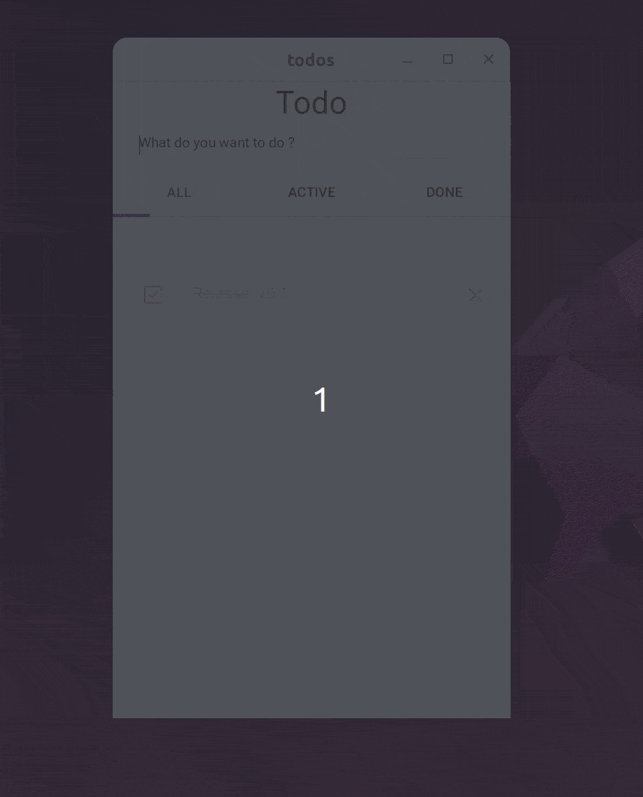
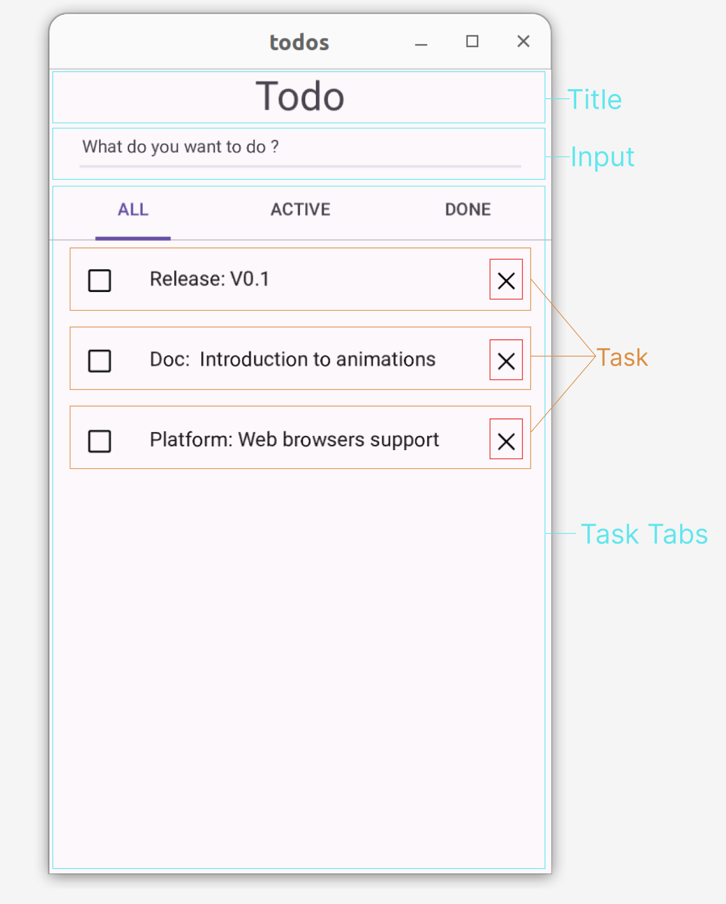

# Ribir Practice: Develop a Todos app

This chapter will show you how to develop a Ribir application by building a simple Todos app, and help you consolidate the basic concepts and usage of Ribir.

This app will allow you to add, delete, edit and mark tasks finish, and support automatic save.

> You will learn:
>
> - How to develop and design a Todos application using the recommended Ribir approach.

## Prerequisites

To complete this tutorial, we assume that you:

- Mastered the basic concepts and syntax of [Rust](https://www.rust-lang.org/learn) language
- Completed the prerequisite tutorial series [Getting Started](../get_started/quick_start.md)

## Showcase



## Code structure

As a GUI framework, one of Ribir's most important goals is to enable you to concentrate on abstracting data structures and algorithms (business logic) during the initial stages of application design, without the need to consider the UI. The UI can be developed as a completely independent module, and they are interacted through the API defined by the former.

So, in the Ribir repository, you will find that almost all non-pure UI examples have two main files: an `xxx.rs` file with the same name as the application, which implements the core data and logic of the application; a `ui.rs` file that implements the UI description of the core data. In addition, there is a `main.rs` file as the entry point of the application.

In this tutorial, we also organize our Todos app in the same way:
  
```text
- src
  - main.rs
  - todos.rs
  - ui.rs
```

## Develop the core

Ribir doesn't start with dividing widgets, organizing hierarchical structures, or managing UI states. Ribir recommends that you first abstract the core data structures and logic of the application, design and define the API, and then organize your UI based on your data and visual effects.

Of course, if multiple people are developing, the above work can be carried out in parallel. Because you need to complete the entire chapter tutorial by yourself, let's proceed step by step in order. The first step is to complete the development of the core data structure part and not consider the UI at all.

```rust ignore
// todos.rs

use serde::{Deserialize, Serialize};
use std::{
  collections::BTreeMap,
  fs::File,
  io::{self, BufWriter, Write},
};

#[derive(Debug, Serialize, Deserialize)]
pub struct Todos {
  tasks: BTreeMap<TaskId, Task>,
  next_id: TaskId,
}

#[derive(Debug, Clone, PartialEq, Serialize, Deserialize)]
pub struct Task {
  id: TaskId,
  pub complete: bool,
  pub label: String,
}

#[derive(Debug, Clone, Copy, PartialEq, Eq, PartialOrd, Ord, Serialize, Deserialize)]
pub struct TaskId(usize);

impl Todos {
  pub fn new_task(&mut self, label: String) -> TaskId {
    let id = self.next_id;
    self.next_id = self.next_id.next();
    self.tasks.insert(id, Task { id, label, complete: false });
    
    id
  }

  pub fn remove(&mut self, id: TaskId) { self.tasks.remove(&id); }

  pub fn get_task(&self, id: TaskId) -> Option<&Task> { self.tasks.get(&id) }

  pub fn get_task_mut(&mut self, id: TaskId) -> Option<&mut Task> { self.tasks.get_mut(&id) }

  pub fn all_tasks(&self) -> impl Iterator<Item = TaskId> + '_ { self.tasks.keys().copied() }
}

impl Task {
  pub fn id(&self) -> TaskId { self.id }
}

impl Todos {
  pub fn load() -> Self {
    std::fs::read(Self::store_path())
      .map(|v| serde_json::from_slice(v.as_slice()).unwrap())
      .unwrap_or_else(|_| Todos {
        tasks: BTreeMap::new(),
        next_id: TaskId(0),
      })
  }

  pub fn save(&self) -> Result<(), io::Error> {
    let file = File::create(Self::store_path())?;
    let mut writer = BufWriter::new(file);
    serde_json::to_writer(&mut writer, self)?;
    writer.flush()?;
    Ok(())
  }

  fn store_path() -> std::path::PathBuf { std::env::temp_dir().join("ribir_todos.json") }
}

impl TaskId {
  pub fn next(&self) -> Self { Self(self.0 + 1) }
}
```

The `Todos` core is mainly composed of three types: `Todos`, `Task`, and `TaskId`. `Todos` is a collection containing all tasks, `Task` is a struct for a task, and `TaskId` is a unique identifier for a task. `Todos` provides methods for adding, deleting, modifying, and querying tasks, as well as the ability to save to a file. Usually, you also need to write comprehensive unit tests to ensure the correctness of your code.

This part of the work is no different from how you usually write Rust code without a GUI. You can organize your code according to your own habits, as long as you can provide a complete API in the end.  In the design philosophy of Ribir applications, this part of the work is very important, but it is not the focus of this tutorial, so we won't go into detail here.


> Tips
>
> Based on such a structure, after completing this part of the work, you can easily turn your core part into a library, and use it to create a CLI application to provide your users with a better development experience and more usage scenarios.

Now your application has a complete logic, but no UI yet. Next, let's use Ribir to build a UI for it.

## Describing the UI

Before we start developing the UI, let's divide the UI into several main parts according to the prototype diagram, so that we can communicate better in the following text:



1. Title area, showing the name of the application
2. Input area, enter the task content, press Enter to add the task
3. Task Tabs, divided into three tabs: All, Active and Completed, which display the corresponding task list respectively
4. Task, the display of a single task, providing editing, marking completion and deletion functions.

### Build the overall structure with Ribir

We have defined the `Todos` type as the root data structure in [Develop the core](#develop-the-core), and now we can directly describe the entire UI from it through `Compose`. Before that, you need to import `todos.rs` and `ui.rs` in `main.rs`, and add a `main` function as the application entry:

```rust ignore
//  main.rs

mod todos;
mod ui;

use ribir::prelude::*;
use std::time::Duration;

fn main() {
  let todos = State::value(todos::Todos::load());

  // save changes to disk every 5 seconds .
  let save_todos = todos.clone_reader();
  
  watch!($todos;)
    .debounce(Duration::from_secs(5), AppCtx::scheduler())
    .subscribe(move |_| {
      if let Err(err) = save_todos.read().save() {
        log::error!("Save tasks failed: {}", err);
      }
    });

  App::run(fn_widget! { todos })
}
```

In `main.rs`, a `State` is first created to save the `Todos` data, and it is passed to the `App::run` method as the root widget, so that the application can run.

Simultaneously, any modifications to `todos` are monitored, and it to the disk every 5 seconds. Currently, your application lacks interaction and cannot modify `todos`, so the auto-save logic won't be triggered. However, as soon as you add interaction, it'll work.

Have you noticed the `;` in `watch!($todo;)`? This is intentional, because we don't want to receive the result of `todos`, but just want to know that it has modified. This is because we will read its latest value in the subscription function to save it.

Then, add the following code to `ui.rs` to describe `Todos` as a widget:

```rust ignore
// ui.rs
use ribir::prelude::*;

impl Compose for Todos {
  fn compose(this: impl StateWriter<Value = Self>) -> impl IntoWidgetStrict<FN> {
    fn_widget! {
      @Column {
        align_items: Align::Center,
        item_gap: 12.,
        @H1 { text: "Todo" }
      }
    }
  }
}
```

When you run the application with `cargo run`, you'll see just a "Todo" title in the window. In the code, we use `Column` as the main widget for `Todo`. This type of widget lines up its child widgets in a vertical column. We've set align_items to Align::Center, this will make the child widgets line up in the center. Set item_gap to `12.` leaves a space of 12 pixels between each widget.

Next, we'll add an empty task tabs to the `Column` to set up our entire structure.

```rust ignore
@Tabs {
  @Tab {
    @TabItem { @{ Label::new("ALL") } }
    @TabPane {
      @{ fn_widget!{ @Text { text: "Coming Soon!" } }}
    }
  }
  @Tab {
    @TabItem { @{ Label::new("ACTIVE") } }
    @TabPane {
      @{ fn_widget!{ @Text { text: "Coming Soon!" } } }
    }
  }
  @Tab {
    @TabItem { @{ Label::new("DONE") } }
    @TabPane {
      @{ fn_widget!{ @Text { text: "Coming Soon!" } }}
    }
  }
}
```

`Tabs` is also provided by the Ribir widgets library. It's a `ComposeChild` widget, and its children must be of the `Tab` type. Since we're not ready to show content in the `Tab` yet, we're using a `Text` widget with "Coming soon!" as a placeholder. However, in `TabPane`, we didn't use the `Text` widget directly. Instead, we used a function widget as a child. This is because `Tabs` requires the content of `TabPane` to be a `GenWidget`, as it only wants to build the content for the active `Tab`, not all `Tabs`. A function widget that supports multiple calls can be converted into a `GenWidget`.

### Add the ability to enter tasks

Now, let's add the ability to enter data: We'll add an `Input` to the `Column`, and when the Enter key is pressed, the content of the `Input` will be added to `Todos` as a task. But wait, how can we access the `Input` itself within an event callback in `Input`?

```rust ignore
@Input {
  on_key_down: move |e| {
    if e.key_code() == &PhysicalKey::Code(KeyCode::Enter) {
      // How to get the `Input` itself here?
    }
  }
}
```

Fortunately, Ribir interacts seamlessly with Rust. Do you remember how we discussed declaring children through variables in the [Composing Widgets](../get_started/quick_start.md#composing-widgets) section?


```rust ignore
@ {
  let input = @Input {};
  @$input {
    on_key_down: move |e| {
    if e.key_code() == &PhysicalKey::Code(KeyCode::Enter)
      && !$input.text().is_empty() {
        $this.write().new_task($input.text().to_string());
        $input.write().set_text("");
      }
    },
    @{ Placeholder::new("What do you want to do ?") }
  }
}

```

Now, add the above code before the `Tabs` in the `Column`. You can now use this input box to add new tasks.

### Adding a Task List

Currently, there's no content in the `Tab`. Let's add some now.

The three tabs have different content, but they all have the same structure. So, you can abstract them into one widget. Since there's no corresponding data structure, you can use a function widget to implement it. Let's call this function `task_list`.

The second widget you can abstract is `Task`. It has its own data structure, but we don't plan to describe it as a widget using `Compose`. This is because we want to implement the delete function for `Task` in this widget, and `Task` alone can't do this. So, abstract another function widget to easily get the context. Let's call this function `task_item`.

Let's look at the implementation of `task_list`:

```rust ignore
// ui.rs

...

fn task_lists(this: &impl StateWriter<Value = Todos>, filter: fn(&Task) -> bool) -> GenWidget {
  let this = this.clone_writer();
  fn_widget! {
    @VScrollBar {
      @Lists {
        @ { pipe!($this;).map(move |_| {
          // Here, we intentionally write a line of code that won't be executed, to tell Ribir that the current closure needs to capture `this`'s Writer, not its Reader
          let _hint_capture_writer = || $this.write();
          
          let mut widgets = vec![];
          for id in $this.all_tasks() {
            if $this.get_task(id).map_or(false, filter) {
              let task = this.split_writer(
                move |todos| todos.get_task(id).unwrap(),
                move |todos| todos.get_task_mut(id).unwrap(),
              );
              widgets.push(task_item(task));
            }
          }
          widgets
        }) }
      }
    }
  }
  .into()
}
```

This function widget uses `Lists` to display the entire list. It listens to changes in `this` through `pipe!($this;).map(move |_| { ... })` to ensure that the task list content changes as `this` changes. Finally, it uses a `VScrollBar` to provide scrolling capability.

Did you notice the line about state splitting?
  
```rust ignore
let task = this.split_writer(
  move |todos| todos.get_task(id).unwrap(),
  move |todos| todos.get_task_mut(id).unwrap(),
);
```

It splits a Writer of Task from `this` and passes it to the `task_item` function widget. This way, the `Task` data can be directly modified in the `task_item` widget without affecting the entire UI of `Todos`.

In `task_lists`, there's a tricky part that you've probably noticed:

```rust ignore
let _hint_capture_writer = || $this.write();
```

Why do we need this line of code? When Ribir parses a move closure, it checks whether `$this` is used within the closure. It then automatically captures the reader or writer of `this` for you, so you don't have to manually clone the reader or writer. If the move closure only uses a read reference (`$this`), it captures the Reader. If it uses a write reference (`$this.write()` or `$this.silent()`), it captures the Writer. In the above closure, `$this`'s write reference isn't used at all, but we need to split a child `Writer` from `this` — and only a Writer can split a child `Writer`. So, we intentionally write this line to force Ribir to capture `this`'s `Writer`.

Next, let's look at the implementation of `task_item`:

```rust ignore
// ui.rs

...

fn task_item<S>(task: S) -> impl IntoWidgetStrict<FN>
where
  S: StateWriter<Value = Task> + 'static,
  S::OriginWriter: StateWriter<Value = Todos>,
{
  let todos = task.origin_writer().clone_writer();

  fn_widget! {
    let id = $task.id();
    let checkbox = @Checkbox { checked: pipe!($task.complete) };
    watch!($checkbox.checked)
      .distinct_until_changed()
      .subscribe(move |v| $task.write().complete = v);

    @ListItem {
      @{ HeadlineText(Label::new($task.label.clone())) }
      @Leading {
        @{ CustomEdgeWidget(checkbox.build(ctx!())) }
      }
      @Trailing {
        cursor: CursorIcon::Pointer,
        on_tap: move |_| $todos.write().remove(id),
        @{ svgs::CLOSE }
      }
    }
  }
}
```

In this function widget, the interesting part is that `Todos` is not passed as a parameter. Instead, it's stipulated that `Task` must be split from `Todos`. This way, you can get the `Writer` of `Todos` in reverse, which allows you to implement the delete function.

Next, use `Checkbox` to show whether the task is complete, monitor its changes, and synchronize the changes back to `Task`.

Finally, use `ListItem` to show a complete task, composing `Checkbox`, delete button and task content together. `ListItem` is also a widget provided by the Ribir widgets library, and specifies its own child type. Here, `HeadlineText` is used to show the title, `Leading` represents the header content, and `Trailing` represents the tail content.

Now, in the `compose` of `Todos`, find `TabPane` and replace the original "coming soon!" with `task_lists`.

```rust ignore
// ui.rs

...

@Tabs {
  @Tab {
    @TabItem { @{ Label::new("ALL") } }
    // new
    @TabPane { @{ task_lists(&this, |_| true) } }
  }
  @Tab {
    @TabItem { @{ Label::new("ACTIVE") } }
    // new
    @TabPane { @{ task_lists(&this, |t| !t.complete )} }
  }
  @Tab {
    @TabItem { @{ Label::new("DONE") } }
    // new
    @TabPane { @{ task_lists(&this, |t| t.complete )} }
  }
}

...
```

### Adding the ability to edit task

Your Todos application is almost complete, but there's one final step: adding the ability to edit the content of a task by double-clicking it.

We'll use a double-click to mark a task as being in edit mode. When a task is not in edit mode, we'll display `task_item`, otherwise, we'll display an `Input`.

Let's go back to `task_lists` and make the following changes:

```rust ignore

fn_widget! {
    // new: Add a new state to record the ID of the task being edited
    let editing = Stateful::new(None);

    @VScrollBar {
      @Lists {
        @ { pipe!($this;).map(move |_| {
          let _hint_capture_this = || $this.write();
          let mut widgets = vec![];

          for id in $this.all_tasks() {
            if $this.get_task(id).map_or(false, cond) {
              let task = this.split_writer(
                move |todos| todos.get_task(id).unwrap(),
                move |todos| todos.get_task_mut(id).unwrap(),
              );
              // new: If the task is in edit mode, display an input box. Otherwise, display the task item.
              let item = pipe!(*$editing == Some($task.id()))
                .value_chain(|s| s.distinct_until_changed().box_it())
                .map(move |b|{
                  if b {
                    let input = @Input { auto_focus: true };
                    $input.write().set_text(&$task.label);
                    @$input {
                      on_key_down: move |e| {
                        let key = e.key_code();
                        if key == &PhysicalKey::Code(KeyCode::Escape) {
                          *$editing.write() = None;
                        } else if e.key_code() == &PhysicalKey::Code(KeyCode::Enter) {
                          let label = $input.text().to_string();
                          if !label.is_empty() {
                            $task.write().label = label;
                            *$editing.write() = None;
                          }
                        }
                      }
                    }.build(ctx!())
                  } else {
                    let item = task_item(task.clone_writer());
                    @$item {
                      on_double_tap: move |_| *$editing.write() = Some(id)
                    }.build(ctx!())
                  }
                });
              widgets.push(item);
            }
          }
          widgets
        }) }
      }
    }
  }
  .into()
```

At this point, your Todos application is complete. You can run the application , then add, delete, and mark tasks, double-click to edit, and even if you close the application and open it again, your task list will still be there because your data is automatically saved to the disk.

Through this tutorial, you should have noticed some features of Ribir. Ribir doesn't emphasize UI state management, but instead operates directly on data through APIs, with the UI automatically responding to data changes. The state is just a wrapper that makes data observable. This design allows you to focus on the design of data structures, algorithms, and APIs, while the UI can directly use APIs to display and manipulate data. By eliminating the middle layer, it also eliminates the complexity brought by these middle layers.

## Improving Styles and Animations

In the above tutorial, you've completed a full Todos application. However, its style and interactions might not be as attractive and modern as you'd like. If you want to further improve your application, you can continue your journey with the Todos application in the [Improving Styles and Animations](./improving_styles_and_animations.md) section.

## Complete Code

```rust ignore
// main.rs
mod todos;
mod ui;
use ribir::prelude::*;
use std::time::Duration;

fn main() {
  let todos = State::value(todos::Todos::load());

  // save changes to disk every 5 seconds .
  let save_todos = todos.clone_reader();
  
  watch!($todos;)
    .debounce(Duration::from_secs(5), AppCtx::scheduler())
    .subscribe(move |_| {
      if let Err(err) = save_todos.read().save() {
        log::error!("Save tasks failed: {}", err);
      }
    });

  App::run(fn_widget! { todos })
}

// todos.rs
use serde::{Deserialize, Serialize};
use std::{
  collections::BTreeMap,
  fs::File,
  io::{self, BufWriter, Write},
};

#[derive(Debug, Serialize, Deserialize)]
pub struct Todos {
  tasks: BTreeMap<TaskId, Task>,
  next_id: TaskId,
}

#[derive(Debug, Clone, PartialEq, Serialize, Deserialize)]
pub struct Task {
  id: TaskId,
  pub complete: bool,
  pub label: String,
}

#[derive(Debug, Clone, Copy, PartialEq, Eq, PartialOrd, Ord, Serialize, Deserialize)]
pub struct TaskId(usize);

impl Todos {
  pub fn new_task(&mut self, label: String) -> TaskId {
    let id = self.next_id;
    self.next_id = self.next_id.next();

    self.tasks.insert(id, Task { id, label, complete: false });
    id
  }

  pub fn remove(&mut self, id: TaskId) { self.tasks.remove(&id); }

  pub fn get_task(&self, id: TaskId) -> Option<&Task> { self.tasks.get(&id) }

  pub fn get_task_mut(&mut self, id: TaskId) -> Option<&mut Task> { self.tasks.get_mut(&id) }

  pub fn all_tasks(&self) -> impl Iterator<Item = TaskId> + '_ { self.tasks.keys().copied() }
}

impl Task {
  pub fn id(&self) -> TaskId { self.id }
}

impl Todos {
  pub fn load() -> Self {
    std::fs::read(Self::store_path())
      .map(|v| serde_json::from_slice(v.as_slice()).unwrap())
      .unwrap_or_else(|_| Todos {
        tasks: BTreeMap::new(),
        next_id: TaskId(0),
      })
  }

  pub fn save(&self) -> Result<(), io::Error> {
    let file = File::create(Self::store_path())?;
    let mut writer = BufWriter::new(file);
    serde_json::to_writer(&mut writer, self)?;
    writer.flush()?;
    Ok(())
  }

  fn store_path() -> std::path::PathBuf { std::env::temp_dir().join("ribir_todos.json") }
}

impl TaskId {
  pub fn next(&self) -> Self { Self(self.0 + 1) }
}


// ui.rs

use crate::todos::{Task, Todos};
use ribir::prelude::{svgs, *};
use std::time::Duration;

impl Compose for Todos {
  fn compose(this: impl StateWriter<Value = Self>) -> impl IntoWidgetStrict<FN> {
    fn_widget! {
      @Column {
        align_items: Align::Center,
        item_gap: 12.,
        @H1 { text: "Todo" }
        @ {
          let input = @Input {};
          @$input {
            on_key_down: move |e| {
            if e.key_code() == &PhysicalKey::Code(KeyCode::Enter)
              && !$input.text().is_empty() {
                $this.write().new_task($input.text().to_string());
                $input.write().set_text("");
              }
            },
            @Text { text:"What do you want to do ?" }
          }
        }
        @Tabs {
          @Tab {
            @TabItem { @{ Label::new("ALL") } }
            @TabPane { @{ task_lists(&this, |_| true) } }
          }
          @Tab {
            @TabItem { @{ Label::new("ACTIVE") } }
            @TabPane { @{ task_lists(&this, |t| !t.complete )} }
          }
          @Tab {
            @TabItem { @{ Label::new("DONE") } }
            @TabPane { @{ task_lists(&this, |t| t.complete )} }
          }
        }
      }
    }
  }
}

fn task_lists(this: &impl StateWriter<Value = Todos>, cond: fn(&Task) -> bool) -> GenWidget {
  let this = this.clone_writer();
  fn_widget! {
    let editing = Stateful::new(None);

    @VScrollBar {
      @Lists {
        @ { pipe!($this;).map(move |_| {
          let _hint_capture_this = || $this.write();
          let mut widgets = vec![];

          for id in $this.all_tasks() {
            if $this.get_task(id).map_or(false, cond) {
              let task = this.split_writer(
                move |todos| todos.get_task(id).unwrap(),
                move |todos| todos.get_task_mut(id).unwrap(),
              );
              let item = pipe!(*$editing == Some($task.id()))
                .value_chain(|s| s.distinct_until_changed().box_it())
                .map(move |b|{
                  if b {
                    let input = @Input { auto_focus: true };
                    $input.write().set_text(&$task.label);
                    @$input {
                      on_key_down: move |e| {
                        let key = e.key_code();
                        if key == &PhysicalKey::Code(KeyCode::Escape) {
                          *$editing.write() = None;
                        } else if e.key_code() == &PhysicalKey::Code(KeyCode::Enter) {
                          let label = $input.text().to_string();
                          if !label.is_empty() {
                            $task.write().label = label;
                            *$editing.write() = None;
                          }
                        }
                      }
                    }.build(ctx!())
                  } else {
                    let item = task_item(task.clone_writer());
                    @$item {
                      on_double_tap: move |_| *$editing.write() = Some(id)
                    }.build(ctx!())
                  }
                });
              widgets.push(item);
            }
          }
          widgets
        }) }
      }
    }
  }
  .into()
}

fn task_item<S>(task: S) -> impl IntoWidgetStrict<FN>
where
  S: StateWriter<Value = Task> + 'static,
  S::OriginWriter: StateWriter<Value = Todos>,
{
  let todos = task.origin_writer().clone_writer();

  fn_widget! {
    let id = $task.id();
    let item = @ListItem {};
    let checkbox = @Checkbox { checked: pipe!($task.complete) };
    watch!($checkbox.checked)
      .distinct_until_changed()
      .subscribe(move |v| $task.write().complete = v);

    @$item {
      @{ HeadlineText(Label::new($task.label.clone())) }
      @Leading {
        @{ CustomEdgeWidget(checkbox.build(ctx!())) }
      }
      @Trailing {
        cursor: CursorIcon::Pointer,
        on_tap: move |_| $todos.write().remove(id),
        @{ svgs::CLOSE }
      }
    }
  }
}

```