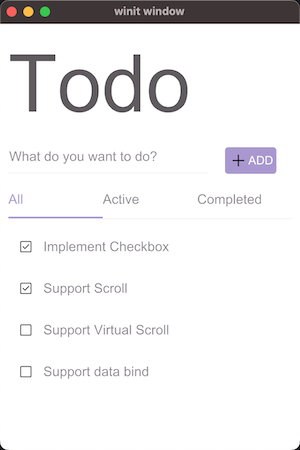

# How to build a Todo Application with Ribir

In this tutorial, We'll start learning how to build a Todo application using Ribir. By following this tutorial in its entirety, you will be able to complete a Todo application like this by yourself:



This will be an exciting journey. Let's go!

## Define the Application data structure

The data structure is the core of the application. In Ribir the interface is just the presentation around the data structure, not interfering with the data structure. So we need to define Todo data structure first.

Now let's define the simplest Todo application data structure. I call this structure `TodoMVP`. And as a simplest Todo application has a list of what it use to save the collection of todo task at least. In Rust, we can use `Vec` structure to describe a list. And then, the list must have many task. A single task needs two fields, `done` and `description`. The `done` field use type `bool` to describe task whether or not to complete, and the `description` field use type `String` to describe task specific information.

We can try to do it in `main.rs`.

```rust
struct Task {
  done: bool,
  description: String,
}
struct TodoMVP {
  tasks: Vec<Task>,
}
fn main() {
  let todo_data = TodoMVP {
    tasks: vec![
      Task {
        done: false,
        description: "Complete how to build an application with Ribir".to_string(),
      }
    ]
  };
}
```

At this point, our basic data structure is built.

## Build the base view using Ribir

We had a base data structure. Now we try to use Ribir to build the part of Todo interface view. The base Todo application needs to have two features, input and display. In the input part, we can use an `Input` widget to describe it what can be used to submit task. And the display part, we can use a `List` widget to describe it, what it can be used to browse the task list. We defined a rough idea of what put `Input` in the upper of the whole and put `List` in the lower. Like these upper and lower parts, here we can use a `Column` widget layout, which is a base vertical arrangement layout widget.

We call Todo to interface it `todo_widget`.

```rust
use ribir::prelude::*;
fn main() {
  // ...
  let todo_widget = widget! {
    Column {
      Input { Placeholder::new("What do you want to do?") }
      Lists {
        ListItem {
          Leading {
            Checkbox { checked: false }
          }
          HeadlineText::new("Complete how to build an application with Ribir")
        }
      }
    }
  };
  app::run(todo_widget);
}
```

You can execute it by `cargo run`, you will see a window what it show `Input` and `Lists`.

## Combine data and view

Now we have Todo data and view. How we combine these both? Actually, our data is core, view is just the presentation of data. So we need to modify the view code.

Here we need to use `Compose` trait to combine data and view. Let's try use `Compose` to modify the above code case.

```rust
// ...
impl Compose for TodoMVP {
  fn compose(this: StateWidget<Self>) -> Widget {
    widget! {
      states { this: this.into_stateful() }
      Column {
        Input { Placeholder::new("What do you want to do?") }
        Lists {
          ListItem {
            Leading {
              Checkbox { checked: false }
            }
            HeadlineText::new("Complete how to build an application with Ribir")
          }
        }
      }
    }
  }
}
fn main() {
  let todo_data = TodoMVP {
    tasks: vec![
      Task {
        done: false,
        description: "Complete how to build an application with Ribir".to_string(),
      }
    ]
  }.into_stateful();
  app::run(todo_data.into_widget());
}
```

And task data is not static. We need to render it dynamically. Here, we need `DynWidget` to represent dynamic widgets.

```rust
use ribir::prelude::*;
#[derive(Clone)]
struct Task {
  done: bool,
  description: String,
}
struct TodoMVP {
  tasks: Vec<Task>,
}
impl TodoMVP {
  fn task(task: Task) -> Widget {
    widget! {
      ListItem {
        Leading {
          Checkbox { checked: task.done }
        }
        HeadlineText::new(task.description.clone())
      }
    }
  }
}
impl Compose for TodoMVP {
  fn compose(this: StateWidget<Self>) -> Widget {
    widget! {
      states { this: this.into_stateful() }
      Column {
        Input { Placeholder::new("What do you want to do?") }
        Lists {
          DynWidget {
            dyns: {
              let tasks = this.tasks.clone();
              tasks
                .into_iter()
                .map(move |task| {
                  TodoMVP::task(task)
                })
            }
          }
        }
      }
    }
  }
}
fn main() {
  let todo_data = TodoMVP {
    tasks: vec![
      Task {
        done: false,
        description: "Complete how to build an application with Ribir".to_string(),
      }
    ]
  }.into_stateful();
  app::run(todo_data.into_widget());
}
```

Now we are finished combining the data and views.

## Add and delete task

As a Todo application, it needs to have two base abilities: adding and deleting tasks. Let's complete these two ability. We already have `Input` but don't submit, so we add a button. `Input` and `Button` use `Row` to layout horizontally. How to submit input content? We need to add submit an event. Usually, we choose `tap` event to trigger submit action.

```rust
widget! {
  // ...
  Column {
    Row {
      Input {
        id: input,
        Placeholder::new("What do you want to do?")
      }
      Button {
        tap: move |_| {
          let description = input.text().to_string();
          this.tasks.push(Task {
            description,
            done: false,
          });
          input.set_text(String::default().into());
        },
        ButtonText::new("ADD")
      }
    }
    // ...
  }
  // ...
}
```

And now we can add task to our application. We need to complete the ability to delete tasks. We should have an `Icon` to respond delete events. We will put the icon in `ListItem`. `ListItem` has `Trailing` to put `Widget` in the trail of list items.

```rust
// ...
impl TodoMVP {
  fn task(this: StateRef<Self>, idx: usize, task: Task) -> Widget {
    let this = this.clone_stateful();
    widget! {
      states { this }
      ListItem {
        Leading {
          Checkbox {
            id: checkbox,
            checked: task.done
          }
        }
        HeadlineText::new(task.description.clone())
        Trailing {
          Icon {
            tap: move |_| { this.tasks.remove(idx); },
            svgs::CLOSE
          }
        }
      }
      finally {
        let_watch!(checkbox.checked)
          .subscribe(move |v| this.silent().tasks[idx].done = v);
      }
    }
  }
}
// ...
```

## Use `Tab` to categorize tasks

Suppose we want to archive task to distinguishing task whether or not done clearly. We can divide three tabs, all, activity, and done. In Ribir, `Tab` widget can help us complete this operation.

```rust
// ...
Tabs {
  Tab {
    TabHeader {
      Text { text: "ALL" }
    }
    TabPane {
      Lists {
        DynWidget {
          dyns: {
            let tasks = this.tasks.clone();
            tasks
              .into_iter()
              .enumerate()
              .filter(move |(_, _)| true)
              .map(move |(idx, task)| {
                TodoMVP::task(this, idx, task)
              })
          }
        }
      }
    }
  }
  Tab {
    TabHeader {
      Text { text: "ACTIVE" }
    }
    TabPane {
      Lists {
        DynWidget {
          dyns: {
            let tasks = this.tasks.clone();
            tasks
              .into_iter()
              .enumerate()
              .filter(move |(_, task)| !task.done)
              .map(move |(idx, task)| {
                TodoMVP::task(this, idx, task)
              })
          }
        }
      }
    }
  }
  Tab {
    TabHeader {
      Text { text: "DONE" }
    }
    TabPane {
      Lists {
        DynWidget {
          dyns: {
            let tasks = this.tasks.clone();
            tasks
              .into_iter()
              .enumerate()
              .filter(move |(_, task)| task.done)
              .map(move |(idx, task)| {
                TodoMVP::task(this, idx, task)
              })
          }
        }
      }
    }
  }
}
// ...
```

Yeah, we've done it, but there has a problem -- too lengthy. In `TabPane`, most of the logic is repeated. Let's optimize it. We can abstract and create panel logic.

```rust
// ...
impl TodoMVP {
  // ...
  fn pane(this: StateRef<Self>, cond: fn(&Task) -> bool) -> Widget {
    let this = this.clone_stateful();
    widget! {
      states { this }
      Lists {
        DynWidget {
          dyns: {
            let tasks = this.tasks.clone();
            tasks
              .into_iter()
              .enumerate()
              .filter(move |(_, task)| cond(task))
              .map(move |(idx, task)| {
                TodoMVP::task(this, idx, task)
              })
          }
        }
      }
    }
  }
}
Tabs {
  Tab {
    TabHeader {
      Text { text: "ALL" }
    }
    TabPane {
      Self::pane(this, |_| true)
    }
  }
  Tab {
    TabHeader {
      Text { text: "ACTIVE" }
    }
    TabPane {
      Self::pane(this, |task| !task.done)
    }
  }
  Tab {
    TabHeader {
      Text { text: "DONE" }
    }
    TabPane {
      Self::pane(this, |task| task.done)
    }
  }
}
// ...
```

Now, this code looks much simpler.

## Use `Scrollbar` to support scrollable

If we have many tasks in the view, the out of view contents we can't show it, we need a scrollable view to show all tasks. In Ribir, we have a built-in widget `Scrollbar`. Scrollbar has direction, horizontal or vertical. In our case, we need scroll in a vertical direction, so we should use `VScrollbar`.

It's straightforward like this:

```rust
// ...
impl TodoMVP {
  // ...
  fn pane(this: StateRef<Self>, cond: fn(&Task) -> bool) -> Widget {
    let this = this.clone_stateful();
    widget! {
      states { this }
      VScrollbar {
        Lists {
          DynWidget {
            dyns: {
              let tasks = this.tasks.clone();
              tasks
                .into_iter()
                .enumerate()
                .filter(move |(_, task)| cond(task))
                .map(move |(idx, task)| {
                  TodoMVP::task(this, idx, task)
                })
            }
          }
        }
      }
    }
  }
}
// ...
```

## Adding transition animation

The Ribir is a moden GUI library. Let's add some animation to show. We add a task moving show when it is mounted.

```rust
impl TodoMVP {
  fn task(this: StateRef<Self>, idx: usize, task: Task) -> Widget {
    let this = this.clone_stateful();
    widget! {
      states { this, mount_idx: Stateful::new(0) }
      ListItem {
        id: item,
        transform: Transform::default(),
        mounted: move |_| {
          *mount_idx += 1;
          mount_animate.run()
        },
        Leading {
          Checkbox {
            id: checkbox,
            checked: task.done
          }
        }
        HeadlineText::new(task.description.clone())
        Trailing {
          Icon {
            tap: move |_| { this.tasks.remove(idx); },
            svgs::CLOSE
          }
        }
      }
      Animate {
        id: mount_animate,
        transition: Transition {
          delay: Some(Duration::from_millis(100).mul_f32((*mount_idx + 1) as f32)),
          duration: Duration::from_millis(150),
          easing: easing::EASE_IN,
          repeat: None,
        },
        prop: prop!(item.transform),
        from: Transform::translation(-400., 0. ),
      }
      finally {
        let_watch!(checkbox.checked)
          .subscribe(move |v| this.silent().tasks[idx].done = v);
      }
    }
  }
}
```

We did it 🎉