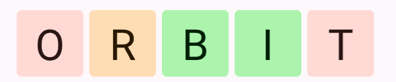
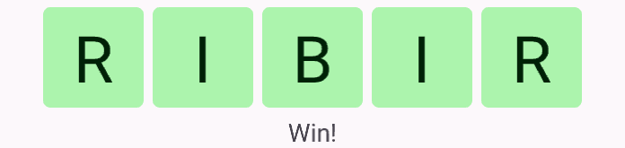

# Wordle Game

Example of a wordle game.

You can run with:

``` sh
cargo run -p wordle_game
```

or run in web:
``` sh
cargo run-wasm -p wordle_game
```

## How to play

You have to guess the hidden word in 5 tries and the color of the letters hints how close you are.
To start the game, just enter the word and press 'Enter' to submit, for example:



``` text
Pink color like O and T, hint that not the letter in the target word at all.
Light orange color like R, hint that the letter in the word but in the wrong spot.
Green color like B and I, hint that the letter in the word and in the correct spot.
```

Another try to find matching letters in the target word.


